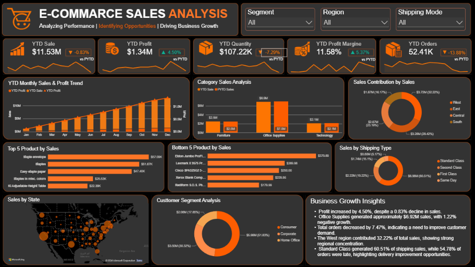

# E-Commerce Sales Growth Analysis
### Business Intelligence | Sales Performance | Profitability | Growth Analytics

---

## Table of Contents

1. Project Overview
2. Business Problem
3. Project Objectives
4. Data Quality Challenges
5. Data Cleaning and Problem Resolution
6. Dashboard Preview
7. Dashboard Features
8. Key Performance Indicators
9. Business Analysis
10. Company Growth Impact
11. DAX Documentation Links
12. Dataset Documentation
13. Repository Structure
14. Tools and Technologies
15. Key Insights
16. Business Value
17. Future Improvements
18. Project Deliverables
19. Conclusion
20. Author

---

# 1. Project Overview

The E-Commerce Sales Growth Analysis Dashboard is an interactive Business
Intelligence project developed to analyze sales performance, profitability,
orders, quantity, customer segments, product categories, and regional growth.

The project converts raw e-commerce transaction data into meaningful
business insights through data preparation, analytical calculations,
interactive visualizations, and KPI-based reporting.

The dashboard is designed to help business stakeholders understand current
performance, compare growth over time, identify underperforming areas, and
make data-driven business decisions.

### Project Name

E-Commerce Sales Growth Analysis

### Project Type

Business Intelligence and Data Analytics Project

### Primary Objective

To analyze e-commerce business performance and identify opportunities for
revenue growth, profitability improvement, and better business decisions.

---

# 2. Business Problem

E-commerce companies generate large volumes of transactional data through
orders, products, customers, regions, sales, and shipping activities.

However, raw transactional data does not directly provide a clear overview
of business performance.

Business stakeholders need answers to questions such as:

- How much sales revenue is being generated?
- Is the business growing compared to the previous year?
- Which product categories perform best?
- Which products generate higher profit?
- Which regions contribute the most revenue?
- Which customer segments are valuable?
- Is the profit margin improving?
- Which business areas are underperforming?
- Where are the opportunities for future growth?

Without a structured analytical dashboard, identifying these insights from
raw data can be time-consuming and difficult.

This project addresses these challenges by providing a centralized dashboard
for monitoring sales, profit, orders, quantity, and growth performance.

---

# 3. Project Objectives

The key objectives of this project are:

- Analyze total sales and profit performance.
- Track year-to-date business performance.
- Compare current performance with the previous year.
- Measure year-over-year growth.
- Analyze order and quantity performance.
- Identify high-performing product categories.
- Identify low-performing products and business areas.
- Analyze regional and state-level performance.
- Understand customer segment contribution.
- Monitor profitability and profit margin.
- Support data-driven business decisions.
- Identify potential opportunities for company growth.

---

# 4. Data Quality Challenges

Before developing the dashboard, the raw transactional data required
review and preparation.

Data-quality challenges that needed attention included:

- Duplicate or repeated records.
- Blank or missing values.
- Incorrect data types.
- Date fields requiring proper formatting.
- Numerical fields requiring validation.
- Inconsistent values in certain columns.
- Raw data requiring transformation before analysis.
- Data structure requiring preparation for accurate calculations.

These issues can impact the accuracy of business metrics such as sales,
profit, orders, quantity, and growth percentages.

Incorrect or unclean data can result in misleading dashboard results and
incorrect business decisions.

---

# 5. Data Cleaning and Problem Resolution

## 5.1 Problem Identification

The raw dataset was reviewed to understand its structure, fields, and
suitability for business analysis.

The data preparation process focused on identifying issues that could affect
the accuracy and reliability of the dashboard.

The main focus areas were:

- Data completeness.
- Data consistency.
- Data types.
- Duplicate records.
- Date fields.
- Numerical fields.
- Data suitability for calculations.

## 5.2 Solution Implemented

Power Query was used to prepare and transform the raw dataset before
developing the dashboard.

The data preparation process included:

1. Reviewing the raw dataset.
2. Checking the available columns.
3. Reviewing blank and missing values.
4. Checking duplicate records.
5. Validating column data types.
6. Formatting date-related columns correctly.
7. Preparing numerical columns for calculations.
8. Reviewing sales, profit, quantity, and order-related fields.
9. Transforming the data into a suitable structure.
10. Loading the prepared data into the analytical model.

## 5.3 Result

The prepared dataset became suitable for:

- Sales performance analysis.
- Profitability analysis.
- Order analysis.
- Quantity analysis.
- Date-based reporting.
- Year-to-date calculations.
- Previous-year comparisons.
- Growth analysis.
- Dashboard visualization.

Data preparation helped establish a more reliable foundation for the
dashboard and reduced the risk of inaccurate analytical results.

> Note: The exact data-cleaning operations should be aligned with the
> transformations implemented in the final Power Query workflow.

---

# 6. Dashboard Preview

## Dashboard Preview Image



## Preview Link

[Open E-Commerce Sales Growth Dashboard Preview](../E-Commarce_Sales_Analysis_Preview.png)

## Power BI Dashboard File

[Open Power BI Dashboard File](../E-Commarce_Sales_Analysis.pbix)

The Power BI file can be downloaded and opened using Microsoft Power BI
Desktop.

---

# 7. Dashboard Features

The dashboard provides an interactive view of e-commerce business
performance.

## 7.1 Sales Performance

The dashboard supports analysis of:

- Total sales.
- Monthly sales trends.
- Year-to-date sales.
- Previous-year sales.
- Year-over-year sales growth.
- Category-level sales.
- Regional sales performance.
- Product-level sales performance.

## 7.2 Profitability Analysis

The dashboard provides insights into:

- Total profit.
- Profit trends.
- Year-to-date profit.
- Previous-year profit.
- Year-over-year profit growth.
- Profit margin.
- Category-level profitability.
- Product-level profitability.

## 7.3 Order and Quantity Analysis

The dashboard helps analyze:

- Total orders.
- Total quantity sold.
- Year-to-date orders.
- Year-to-date quantity.
- Previous-year comparisons.
- Order growth.
- Quantity growth.
- Product demand patterns.

## 7.4 Product and Category Analysis

The dashboard supports:

- Top-performing products.
- Low-performing products.
- Category-level sales comparison.
- Category-level profit comparison.
- Product contribution analysis.
- Identification of growth opportunities.

## 7.5 Regional Analysis

Regional analysis includes:

- Sales by state.
- Regional contribution.
- State-level performance.
- Regional profitability.
- High-performing locations.
- Low-performing locations.
- Potential regional growth opportunities.

## 7.6 Customer Segment Analysis

The dashboard helps analyze:

- Sales by customer segment.
- Profit by customer segment.
- Segment-level performance.
- Customer segment contribution.
- Potential customer-focused opportunities.

## 7.7 Shipping Analysis

Shipping-related analysis supports:

- Understanding shipping distribution.
- Reviewing shipping patterns.
- Supporting operational analysis.
- Identifying areas for further investigation.

---

# 8. Key Performance Indicators

The dashboard includes business-focused KPIs such as:

| KPI | Business Purpose |
|---|---|
| Total Sales | Measures overall revenue generated |
| YTD Sales | Measures sales performance during the current year |
| YOY Sales Growth | Compares sales performance with the previous year |
| Total Profit | Measures total profit generated |
| YTD Profit | Measures current-year profit performance |
| YOY Profit Growth | Compares profit performance with the previous year |
| Profit Margin | Measures profitability relative to sales |
| Total Orders | Measures the number of unique orders |
| YTD Orders | Measures current-year order performance |
| Total Quantity | Measures the total quantity sold |
| YTD Quantity | Measures current-year quantity performance |

---

# 9. Business Analysis

## 9.1 Sales Growth Analysis

Sales growth analysis helps identify changes in revenue performance over
time.

The dashboard supports:

- Current sales monitoring.
- Year-to-date sales analysis.
- Previous-year comparison.
- Monthly performance review.
- Category-level growth analysis.
- Regional sales comparison.

This analysis helps management understand revenue trends and identify
areas that require additional attention.

## 9.2 Profitability Analysis

Profitability analysis provides a view of the financial performance of
products, categories, and regions.

The dashboard helps identify:

- High-profit categories.
- Low-profit categories.
- Profit margin performance.
- Changes in profitability.
- Products with high sales but lower profitability.

This supports more informed pricing, product, and cost-related decisions.

## 9.3 Product Performance Analysis

Product performance analysis helps the business understand which products
contribute significantly to sales and profit.

The analysis can support:

- Product prioritization.
- Inventory planning.
- Promotional decisions.
- Product portfolio review.
- Identification of underperforming products.

## 9.4 Regional Performance Analysis

Regional analysis provides a comparison of business performance across
different states and locations.

It helps management identify:

- Strong-performing regions.
- Weak-performing regions.
- Regional revenue contribution.
- Regional profitability.
- Areas requiring additional investigation.

## 9.5 Customer Segment Analysis

Customer segment analysis helps the company understand the contribution
of different customer groups.

This information can support:

- Customer-focused marketing.
- Segment-level performance tracking.
- Retention-related analysis.
- Promotional planning.
- Customer experience improvement.

---

# 10. How the Dashboard Supports Company Growth

The dashboard can support company growth by providing management with
structured and actionable business information.

## 10.1 Revenue Growth

The dashboard helps management monitor revenue and identify sales trends.

It can support:

- Tracking sales growth.
- Identifying high-revenue categories.
- Comparing monthly performance.
- Reviewing regional sales contribution.
- Identifying products with strong sales performance.

### Business Impact

Management can use these insights to investigate growth opportunities and
focus business activities on areas with stronger sales potential.

---

## 10.2 Profitability Improvement

Revenue growth is important, but sustainable business growth also requires
healthy profitability.

The dashboard provides visibility into:

- Total profit.
- Profit margin.
- Product profitability.
- Category profitability.
- Profit growth over time.

### Business Impact

The company can investigate products or categories that generate high sales
but contribute comparatively lower profit.

This may support decisions related to:

- Pricing.
- Discounts.
- Product selection.
- Cost control.
- Product portfolio optimization.

---

## 10.3 Product and Category Optimization

The dashboard helps identify high-performing and underperforming products
and categories.

### Business Impact

The company can use this information to support:

- Inventory planning.
- Marketing prioritization.
- Promotional campaigns.
- Product portfolio decisions.
- Performance improvement initiatives.

---

## 10.4 Regional Expansion Opportunities

Regional analysis helps the company compare performance across different
locations.

### Business Impact

Management can investigate:

- Regions with strong sales.
- Regions with low performance.
- Locations with higher profit contribution.
- Areas requiring additional marketing.
- Potential opportunities for regional expansion.

The dashboard provides information for further business investigation rather
than automatically determining the best expansion decision.

---

## 10.5 Customer Segment Improvement

Customer segment analysis helps management understand how different
customer groups contribute to business performance.

### Business Impact

The company can use segment-level insights to support:

- Targeted marketing.
- Customer retention initiatives.
- Personalized promotions.
- Customer experience improvements.
- Segment-specific business strategies.

---

## 10.6 Inventory and Demand Planning

Order and quantity analysis provides visibility into product demand and
order activity.

### Business Impact

The company can use these insights to support:

- Inventory planning.
- Product availability.
- Demand monitoring.
- Stock-related investigations.
- Operational planning.

---

## 10.7 Early Identification of Business Issues

The dashboard can highlight changes such as:

- Declining sales.
- Declining profit.
- Reduced order volume.
- Lower quantity sold.
- Weak category performance.
- Reduced profit margin.
- Regional performance decline.

### Business Impact

Early visibility allows management to investigate the possible causes and
consider corrective actions before problems become more significant.

---

## 10.8 Data-Driven Decision-Making

The dashboard creates a centralized view of business performance.

It reduces the need to manually review large volumes of raw transactional
data for every reporting requirement.

### Business Impact

Management can use the dashboard to:

- Monitor important KPIs.
- Compare business performance.
- Identify performance changes.
- Prioritize investigations.
- Support business planning.
- Improve reporting efficiency.

---

# 11. DAX Documentation Links

The detailed DAX formulas are maintained separately in the DAX Formula
documentation folder.

- [Calendar Table Measures](Calender_Table__Measures.md)
- [Sales Performance Measures](../Sales_Performance_Measures.md)
- [Profit Performance Measures](../Profit_Performance_Measures.md)
- [Profit Margin Measures](../Profit_Margin_Measures.md)
- [Orders Performance Measures](../Orders_Performance_Measures.md)
- [Quantity Performance Measures](../Quantity_Performance_Measures.md)

---

# 12. Dataset Documentation

The project dataset is stored in the Data Set folder.

## Dataset Files

- `ecommerce_data.csv`
- `us_state_long_lat_codes.csv`

## Dataset Folder

[View Dataset Folder](../Data%20Set/)

## Dataset Usage

The dataset supports:

- Sales analysis.
- Profit analysis.
- Order analysis.
- Quantity analysis.
- Date-based analysis.
- Regional analysis.
- State-level mapping.
- Business performance reporting.

---

# 13. KPI Logo Assets

The project contains visual assets used for KPI presentation.

## KPI Asset Folder

[View KPI Logo Assets](../KPIs%20Logo/)

## Available Assets

- E-Commerce Logo
- Margin Logo
- Orders Logo
- Profit Logo
- Quantity Logo
- Sales Logo

## Asset Links

- [E-Commerce Logo](../KPIs%20Logo/E-Commerce_logo.png)
- [Margin Logo](../KPIs%20Logo/Margin_logo.png)
- [Orders Logo](../KPIs%20Logo/Orders_logo.png)
- [Profit Logo](../KPIs%20Logo/Profit_logo.png)
- [Quantity Logo](../KPIs%20Logo/Quantity_logo.png)
- [Sales Logo](../KPIs%20Logo/Sales_logo.png)

---

# 14. Repository Structure

```text
E-Commerce-Sales-Growth-Analysis/


├── Data Set/
│   ├── ecommerce_data.csv
│   └── us_state_long_lat_codes.csv
│
├── Dax Formula/
│   ├── Calender_Table_Measures.md
│   ├── Orders_Performance_Measures.md
│   ├── Profit_Margin_Measures.md
│   ├── Profit_Performance_Measures.md
│   ├── Quantity_Performance_Measures.md
│   └── Sales_Performance_Measures.md
│
└── KPIs Logo/
│   ├── E-Commerce_logo.png
│    ├── Margin_logo.png
│   ├── Orders_logo.png
│    ├── Profit_logo.png
│    ├── Quantity_logo.png
│   └── Sales_logo.png
│
├── Project_Documentation.md
├── eCommerce_Sales_Dashboard.pbix
├── E-Commerce_Sales_Analysis_Preview.png
├── README.md

```

# 15. Key Insights Supported by the Project

The dashboard supports the analysis of important business performance
indicators and helps stakeholders identify trends, opportunities, and
areas requiring further investigation.

### Sales Insights

- Monitor total sales performance.
- Compare current sales with previous-year performance.
- Identify monthly sales trends.
- Analyze category-wise sales contribution.
- Identify high-performing and low-performing products.

### Profitability Insights

- Monitor total profit.
- Analyze profit margin.
- Compare current and previous-year profit.
- Identify profitable product categories.
- Investigate products with high sales but lower profitability.

### Order and Quantity Insights

- Monitor total order volume.
- Analyze quantity sold.
- Compare order performance over time.
- Identify changes in product demand.
- Review order and quantity growth trends.

### Regional Insights

- Compare sales performance across states.
- Identify high-performing regions.
- Analyze regional profit contribution.
- Identify regions requiring further investigation.
- Explore potential regional growth opportunities.

### Customer Segment Insights

- Compare customer segment performance.
- Analyze sales contribution by segment.
- Review profit contribution by segment.
- Identify customer groups requiring additional analysis.

> The actual business insights depend on the selected date range, filters,
> and values displayed in the dashboard.

---

# 16. Business Value

The E-Commerce Sales Growth Analysis Dashboard provides a centralized
view of business performance and supports data-driven decision-making.

### Revenue Monitoring

The dashboard helps management monitor sales performance and identify
changes in revenue over time.

### Profitability Improvement

Profit-related metrics help identify profitable business areas and
products that may require further profitability analysis.

### Product Optimization

Product and category analysis supports inventory planning, promotional
decisions, and product performance reviews.

### Regional Performance

Regional analysis helps stakeholders compare locations and investigate
potential market opportunities.

### Customer Understanding

Customer segment analysis provides insights into customer contribution
and supports segment-focused business strategies.

### Performance Monitoring

KPIs allow management to monitor business performance and identify
areas that may require corrective action.

### Reporting Efficiency

The dashboard reduces the need to manually review large volumes of
transactional data for regular business reporting.

### Decision Support

The dashboard provides structured information that can support:

- Business planning.
- Performance reviews.
- Revenue analysis.
- Profitability investigations.
- Product decisions.
- Regional analysis.
- Operational discussions.

> The dashboard supports business decisions through analytical insights.
> Final decisions should also consider business context and additional
> operational information.

---

# 17. Future Improvements

The following improvements can be considered for future versions of
the project.

## 17.1 Advanced Analytics

- Sales forecasting.
- Demand forecasting.
- Customer lifetime value analysis.
- Customer retention analysis.
- Product profitability analysis.

## 17.2 Operational Analysis

- Inventory performance analysis.
- Stock availability analysis.
- Return and cancellation analysis.
- Shipping performance analysis.
- Delivery-time analysis.

## 17.3 Business Intelligence Enhancements

- Automated data refresh.
- Additional data-source integration.
- Role-based dashboard access.
- Automated business alerts.
- Advanced drill-through reports.
- Mobile-friendly dashboard design.

## 17.4 Decision Support Enhancements

- Product opportunity matrix.
- Regional opportunity analysis.
- Discount impact analysis.
- Customer segmentation.
- Profitability-based product classification.
- Management summary dashboard.

These improvements can extend the dashboard's analytical capabilities and
support more advanced business requirements.

---

# 18. Project Deliverables

The project contains the following deliverables:

| Deliverable | Description |
|---|---|
| Power BI Dashboard | Interactive e-commerce performance dashboard |
| Dataset | E-commerce transactional data |
| Calendar Table | Date-based analytical structure |
| DAX Documentation | Separate documentation for analytical measures |
| KPI Logo Assets | Visual assets used in KPI presentation |
| Preview Image | Dashboard preview for repository visitors |
| Project Documentation | Complete project explanation and business analysis |
| Business Analysis | Sales, profit, order, quantity, and growth analysis |

## Project Files

- `eCommerce_Sales_Dashboard.pbix`
- `E-Commerce_Sales_Analysis_Preview.png`
- `Project_Documentation.md`

## Documentation Links

- [DAX Formula Documentation](../Dax%20Formula/)
- [Dataset Folder](../Data%20Set/)
- [KPI Logo Assets](../KPIs%20Logo/)

---

# 19. Key Learning Outcomes

This project provided practical experience in business intelligence,
data analysis, and dashboard development.

### Data Preparation

- Understanding raw transactional data.
- Reviewing data quality.
- Identifying potential data issues.
- Transforming data for analysis.
- Preparing data for reporting.

### Data Modeling

- Creating a calendar table.
- Structuring data for time-based analysis.
- Preparing data for business calculations.
- Understanding relationships between tables.

### Analytical Skills

- Creating business KPIs.
- Analyzing sales performance.
- Analyzing profitability.
- Comparing current and previous-year performance.
- Measuring growth trends.
- Reviewing product and regional performance.

### Dashboard Development

- Designing interactive dashboards.
- Creating KPI cards.
- Developing business-focused visualizations.
- Presenting data in a structured format.
- Improving dashboard readability.

### Business Thinking

- Understanding business performance.
- Identifying performance gaps.
- Connecting metrics with business questions.
- Interpreting sales and profitability trends.
- Supporting data-driven decision-making.

### Documentation and Presentation

- Organizing project files.
- Maintaining separate DAX documentation.
- Creating dashboard preview links.
- Presenting analytical findings professionally.
- Structuring a GitHub project repository.

---

# 20. Project Limitations

The dashboard is based on the available dataset and its underlying
data structure.

The accuracy of the analysis depends on:

- Data quality.
- Data completeness.
- Available date range.
- Correct data relationships.
- Correct column data types.
- Accuracy of analytical measures.
- Data refresh frequency.
- Source data validation.

## Important Considerations

### Data Accuracy

The dashboard results depend on the accuracy of the source dataset.

### Data Coverage

The analysis is limited to the fields and time period available in
the dataset.

### Business Context

Dashboard metrics may not explain the complete reason behind a business
performance change.

### Further Investigation

Unexpected results should be investigated using additional operational
and business information.

### Reporting Validation

The dashboard should be validated against official source-system totals
before being used for formal business reporting.

---

# 21. Resume-Ready Project Summary

Developed an interactive E-Commerce Sales Growth Analysis Dashboard to
analyze sales, profit, orders, quantity, customer segments, product
categories, and regional performance. Prepared transactional data using
Power Query and developed KPI-based analysis for YTD performance,
previous-year comparison, and YOY growth. Designed business-focused
visualizations to support profitability analysis, performance monitoring,
and data-driven decision-making.

---

# 22. Conclusion

The E-Commerce Sales Growth Analysis project demonstrates how raw
transactional data can be transformed into a structured business
intelligence solution.

The dashboard combines data preparation, data modeling, KPI analysis,
and interactive visualization to provide insights into:

- Sales performance.
- Profitability.
- Order volume.
- Quantity sold.
- Product performance.
- Customer segments.
- Regional contribution.
- Business growth trends.

The project helps stakeholders understand business performance, identify
areas requiring further investigation, and explore potential opportunities
for revenue growth and profitability improvement.

It demonstrates the practical application of business intelligence and
data analytics in solving real-world business reporting requirements.

---

# 23. Author

**Name:** Neeraj Kumar Sahu

**Field:** Data Science

**Project:** E-Commerce Sales Growth Analysis

**Project Type:** Business Intelligence and Data Analytics

**Purpose:** Business Performance Analysis and Decision Support

---

# 24. Project Links

- [Dashboard Preview](../E-Commerce_Sales_Analysis_Preview.png)
- [Power BI Dashboard File](../eCommerce_Sales_Dashboard.pbix)
- [DAX Formula Documentation](../Dax%20Formula/)
- [Dataset Folder](../Data%20Set/)
- [KPI Logo Assets](../KPIs%20Logo/)

---
